# Open Perfboard

<p align="center">
  
</p>

<p align="center">
  <b>Open-Perfboard</b><br />
  찍고 이으면 설계와 문서 작성이 되는 All-in-One Offline Design Program
</p>

<div align="center">

[](LICENSE)
[](../../releases/latest)
[](#설치)


[English](README.en.md) · [설치](#설치) · [사용법](#사용법) · [의견 보내기](#의견-보내기) · [개발 계획](#개발-계획)

</div>

<p align="center">
  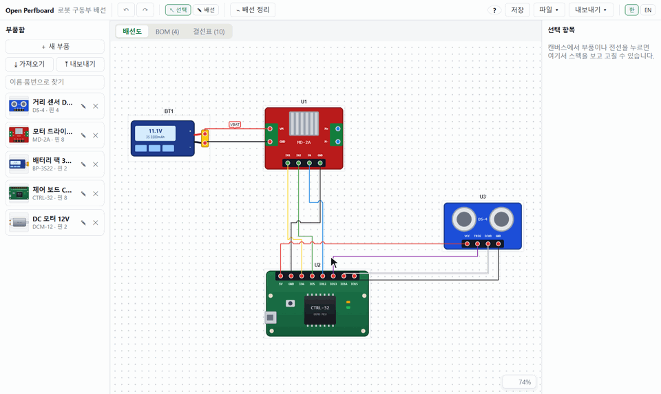
</p>

> 지금은 **기능을 확인하는 단계**입니다. [의견](#의견-보내기)을 남겨 주시면 다음 방향에 반영하겠습니다.

## 기능

- **부품 작업실**: 상자·원·삼각형·선·글상자로 부품 그림을 그리거나 사진을 넣고, 단자를 클릭해 핀 등록. 보조선으로 핀을 고른 간격으로 놓기, 데이터시트 PDF 첨부. 하우징·단자·수축 튜브·전선 같은 부속 부품도 같은 곳에서. 부품함 파일(`.opblib`)을 문서처럼 열고 저장
- **회로도 기호**: 부품마다 기호가 자동으로 만들어지고 몸통·핀 자리를 고칠 수 있음. 저항·축전기·코일·다이오드·LED·트랜지스터·MOSFET·연산 증폭기·논리 게이트·배터리·스위치 등 기본 기호 30종을 골라 쓰기
- **핀과 핀 잇기**: 직각 배선, 분기, 교차 점프, 부품 줄 맞추기·격자 맞춤, 글 상자 메모, 모서리 손잡이로 크기 조절. 전선은 부품을 가로지르지 않음
- **회로도**: 배선도마다 회로도 탭. 같은 부품·연결이 기호로 보이고, 회로도에서 이으면 배선도에도 전선이 생김. 기호 옮기기·회전·반전, 넷 라벨
- **결선표·부품표 자동 생성**: 전선 색(기본 8색 + RGB 스펙트럼·숫자 입력)·규격·메모, 단가·합계(원/달러, 환율 환산), 조달처·구매 링크
- **부속 부품**: 하우징·단자·수축 튜브·전선을 부품함에 등록해 두면 커넥터 짝과 전선마다 고를 수 있고, BOM이 제안 수량과 함께 넣을지 물어봄
- **여러 배선도**: 아래 탭에서 배선도를 추가·전환하고, BOM·결선표에 넣을 배선도를 골라 합쳐 봄. 여러 개면 `.zip` 하나로 저장
- **연결 라벨**: 선 대신 `제어 보드 -> IMU : SDA` 같은 이름표로 어디와 어떻게 이어지는지 표시. 신호 방향은 결선표에서 전선마다 정하고, 부품을 누르면 이어진 부품을 하나씩 넘겨 봄
- **내보내기**: PDF 보고서(배선도·회로도·BOM·결선표), 엑셀·CSV, PNG, **KiCad 회로도(`.kicad_sch`, 기호 포함)**
- **그 밖에**: 부품·신호 찾기(Ctrl+F, 모든 배선도), 부품함·선택 항목 창 접기, 자동 저장·복구, 부품함 공유(`.opblib`), 한국어/English, 부품·전선 수 제한 없음.

| 부품 작업실 | 회로도 기호 |
| --- | --- |
| 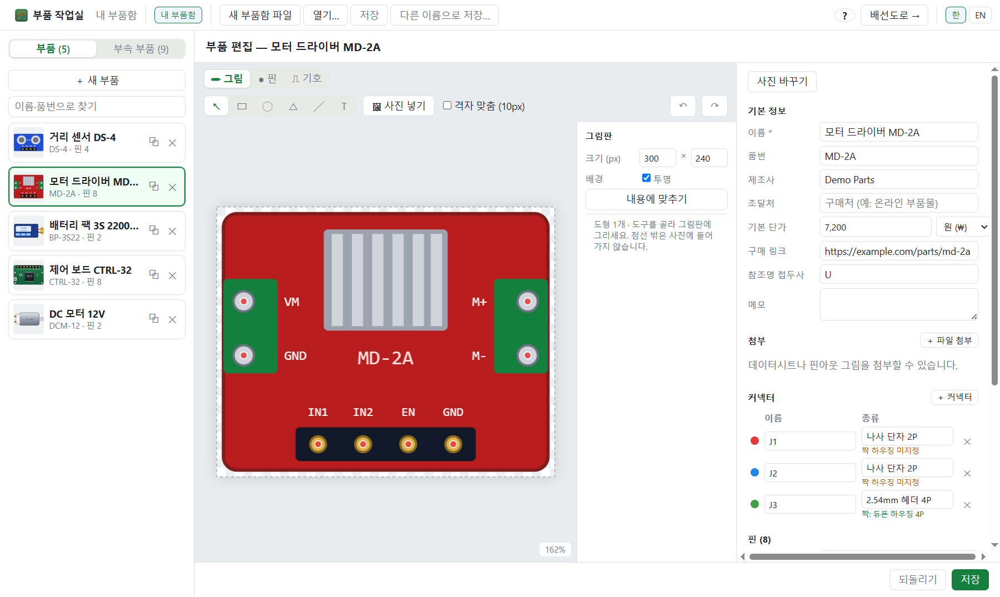 | 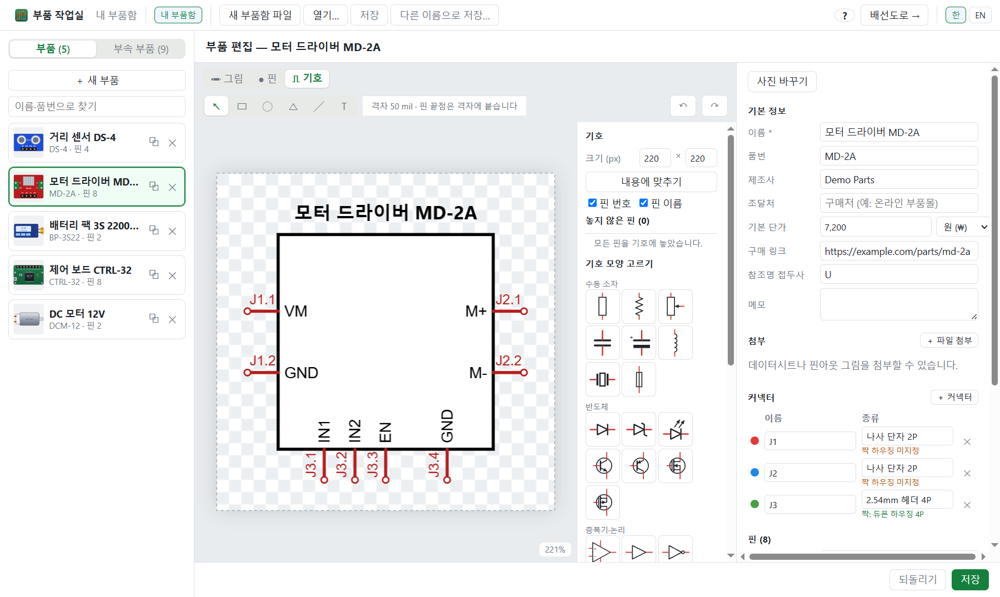 |
| **부품 편집기** | **전선 스펙** |
| 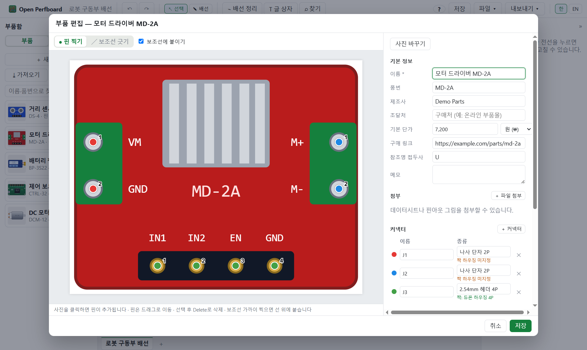 | 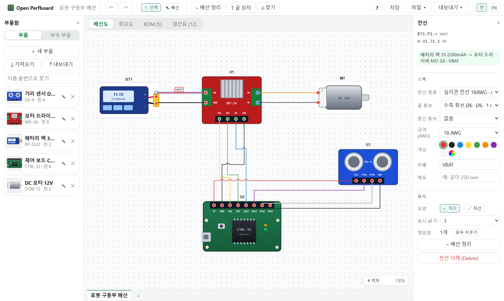 |
| **부품표 (BOM)** | **결선표** |
| 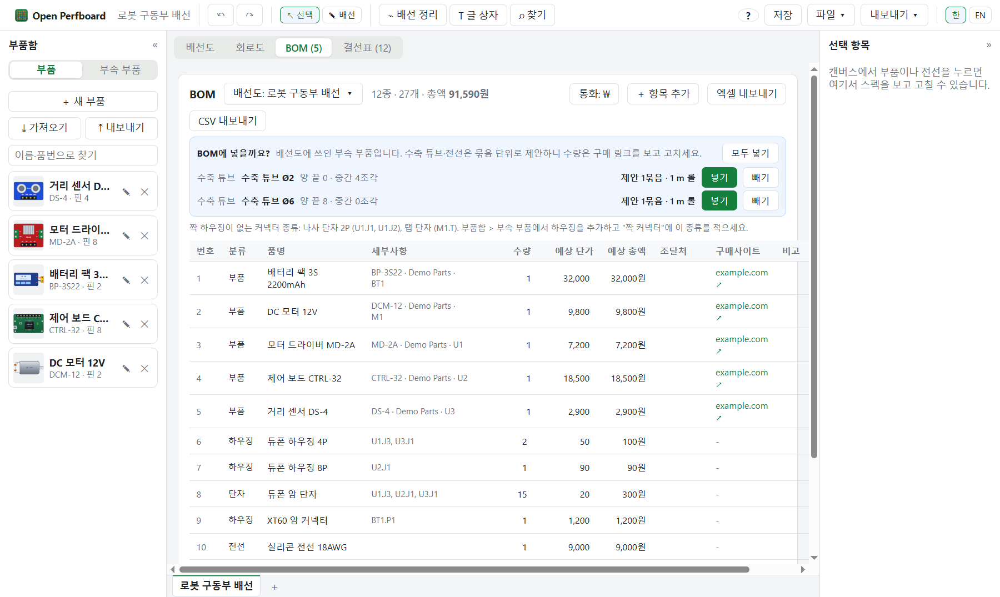 | 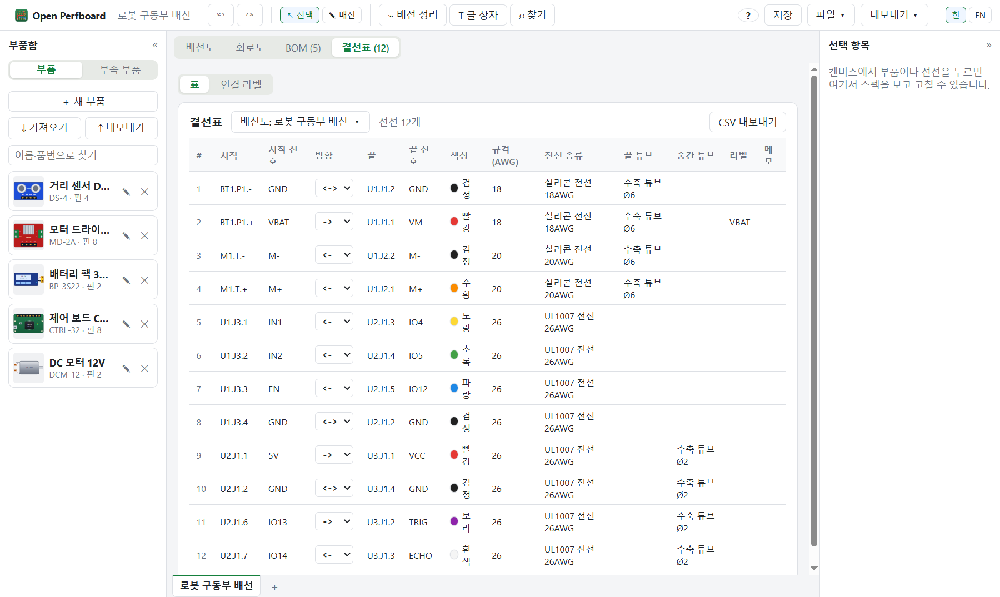 |

**회로도**: 배선도와 같은 부품·연결을 기호로 봅니다. 제어 신호처럼 멀리 가는 선은 넷 라벨로 바꿔 깔끔하게 보이고, **내보내기 ▾ → KiCad 회로도**로 KiCad에서 바로 열 수 있습니다.

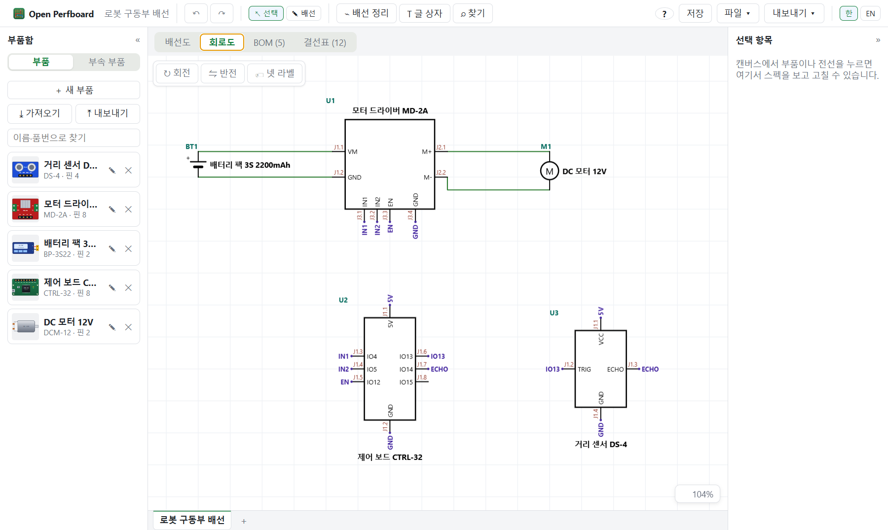

**결선표 연결 라벨**: 부품 사진의 핀에서 선이 나와 이름표에 닿습니다. 같은 이름표끼리 이어져 있고, 화살표가 신호 방향입니다. 이름표를 누르면 짝과 전선 정보가 나오고, 위쪽 막대에서 신호 방향(`->` `<-` `<->`)을 바꿉니다. 부품 사진이나 **연결 보기**를 누르면 간이 창이 떠서, 왼쪽에 그 부품, 오른쪽에 이어진 부품을 하나씩(◀ ▶ 또는 목록) 크게 봅니다.

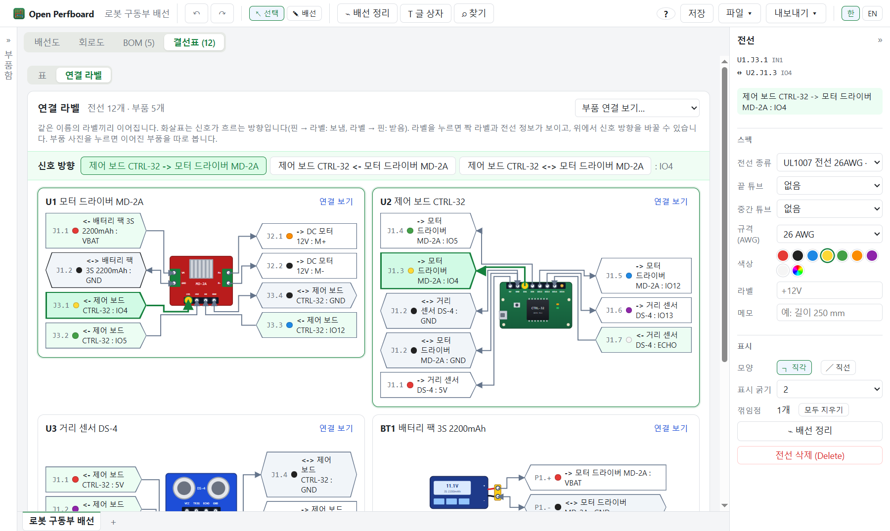

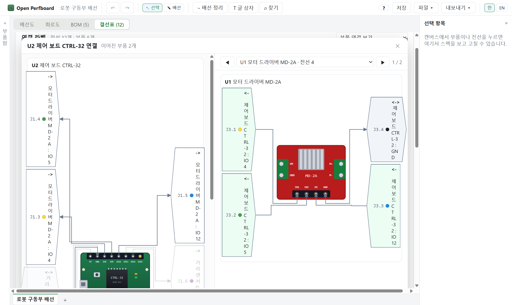

## 설치

[Releases](../../releases/latest)에서 내 운영체제에 맞는 파일을 내려받습니다. 계정·인터넷 연결 없이 동작합니다.

### Windows 10 / 11 (64비트)

1. `Open Perfboard Setup <버전>.exe` 내려받기
2. 실행 (관리자 권한 불필요)

> "Windows의 PC 보호" 창이 뜨면 **추가 정보 → 실행**을 누르세요.

### Linux (64비트)

| 배포판 | 파일 | 설치 |
| --- | --- | --- |
| Ubuntu·Debian | `open-perfboard-<버전>-amd64.deb` | `sudo apt install ./open-perfboard-<버전>-amd64.deb` |
| Fedora | `open-perfboard-<버전>-x86_64.rpm` | `sudo dnf install ./open-perfboard-<버전>-x86_64.rpm` |
| 그 밖 | `open-perfboard-<버전>-x86_64.AppImage` | `chmod +x` 후 실행 |

설치하면 앱 메뉴에 생기고 `.opb` 파일을 두 번 눌러 열 수 있습니다. 한글이 네모로 보이면 한글 글꼴을 설치하세요 (Ubuntu `fonts-noto-cjk`, Fedora `google-noto-sans-cjk-fonts`).

> AppImage가 실행되지 않으면: Fedora는 `sudo dnf install fuse-libs`, Ubuntu 23.10 이상은 샌드박스 제한 때문일 수 있으니 deb 설치를 권합니다.

## 사용법

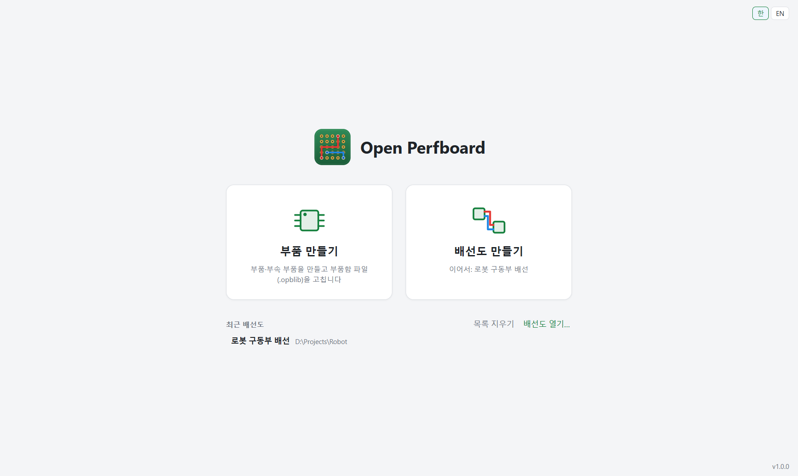

1. **부품 만들기**: 홈 **부품 만들기** → **＋ 새 부품** → 그림을 그리거나 사진을 넣고 → **핀** 탭에서 단자 클릭으로 핀 찍기 → **저장**
2. **배치**: 홈 **배선도 만들기** → 부품을 캔버스로 끌어다 놓기
3. **잇기**: `W` → 핀 클릭 → 다른 핀 클릭 (빈 곳 클릭 = 꺾기)
4. **확인**: 위쪽 **회로도 / BOM / 결선표** 탭
5. **내보내기**: **내보내기 ▾** → PDF·엑셀·PNG·KiCad 회로도

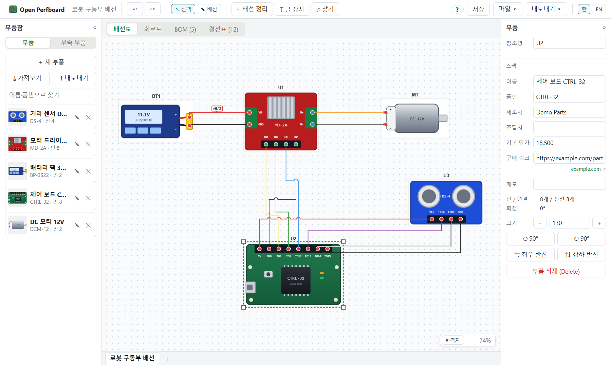

| 키 | 동작 | 키 | 동작 |
| --- | --- | --- | --- |
| `V` / `W` | 선택 / 배선 모드 | `R` / `F` | 회전 / 반전 |
| `Esc` | 그리기 취소 | `Delete` | 삭제 |
| `Ctrl+Z` / `Ctrl+Y` | 실행 취소 / 다시 | `Home` | 전체 보기 |
| 휠 | 확대 / 축소 | `Space`+드래그 | 화면 이동 |

전체 단축키는 앱의 **?** 버튼(`F1`)에서 볼 수 있습니다.

## 의견 보내기

- [이슈](../../issues/new)로 불편했던 점이나 개선할 점을 알려 주세요.
- 마음에 드셨다면 **⭐ 별** 하나가 큰 힘이 됩니다!!!!

## 개발 계획

1. 전선 절단표
2. 여러 배선도를 KiCad 계층 시트로 한 번에 내보내기
3. AI 부품 등록
4. 배선도마다 입출력 포트, GPIO 동작 시뮬레이션 (Arduino·ESP32·STM32·Raspberry Pi)

최종 목표는 **펌웨어 컴파일과 시뮬레이션(SILS·HILS)** 까지 이 앱에서 하는 것입니다.

## 개발

Node.js 22 이상이 필요합니다.

```bash
npm ci              # 의존성 설치
npm run dev         # 개발 실행
npm run check       # 타입 검사 + 단위 테스트
npm run test:e2e    # E2E 테스트
npm run dist:win    # Windows 설치 파일 → dist/
npm run dist:linux  # Linux 설치 파일 (AppImage·deb·rpm, Linux에서) → dist/
```

Linux(Ubuntu·Fedora)에서도 같은 명령을 씁니다. 한글 글꼴(Ubuntu `fonts-noto-cjk`, Fedora `google-noto-sans-cjk-fonts`)과, 설치 파일을 만들 때는 `rpm`(Ubuntu) 또는 `rpm-build`(Fedora)가 필요합니다.

> PowerShell(VS Code 기본 터미널)에서 `npm.ps1 파일을 로드할 수 없습니다` 오류가 나면 한 번만 `Set-ExecutionPolicy -Scope CurrentUser RemoteSigned`를 실행하고 새 터미널을 여세요. 설정을 바꾸지 않으려면 `npm` 대신 `npm.cmd`를 쓰면 됩니다.

## 라이선스

[GPL-3.0-or-later](LICENSE). 누구나 쓰고 고칠 수 있으며, 고친 것을 배포할 때는 소스도 공개해야 합니다.

> 본 프로젝트는 CLAUDE Code로 개발되었습니다.
