# Open Perfboard

<p align="center">
  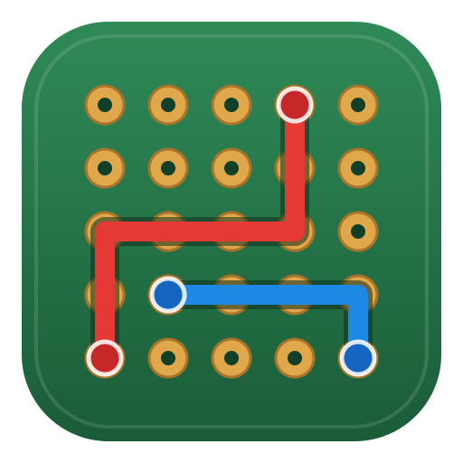
</p>

<p align="center">
  <b>Open-Perfboard</b><br />
  Place pins and connect them — design and documentation in one All-in-One Offline Design Program
</p>

<div align="center">

[](LICENSE)
[](../../releases/latest)
[](#install)


[한국어](README.ko.md) · [Install](#install) · [Usage](#usage) · [Feedback](#feedback) · [Roadmap](#roadmap)

</div>

<p align="center">
  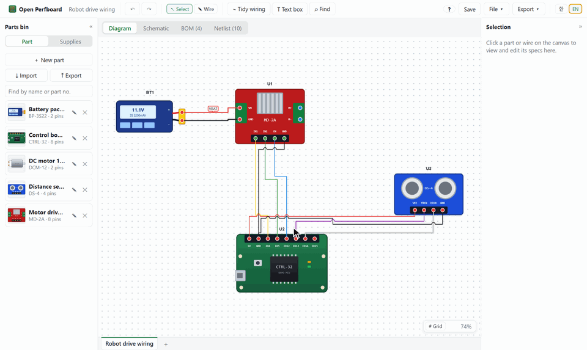
</p>

> This project is **in its feature-testing stage**. Please leave [feedback](#feedback) — it will shape what comes next.

## Features

- **Part studio**: draw a part with boxes, circles, triangles, lines and text boxes, or drop in a photo, then click terminals to add pins. Guide lines space pins evenly; attach datasheet PDFs. Supplies (housings, terminals, heat-shrink, wire) are made in the same place. Parts bin files (`.opblib`) open and save like documents
- **Schematic symbols**: every part gets a symbol automatically, and you can edit its body and pin positions. Pick from 30 basic symbols: resistor, capacitor, inductor, diode, LED, transistors, MOSFETs, op-amp, logic gates, battery, switches and more
- **Pin-to-pin wiring**: orthogonal routing, branches, crossing hops, part alignment and grid snap, text-box notes, resize with corner handles. Wires never run across parts
- **Schematic**: a schematic tab for every diagram. The same parts and connections appear as symbols, and connecting pins on the schematic adds the wire to the diagram too. Move, rotate and mirror symbols; net labels
- **Wire list and BOM, generated as you draw**: wire color (8 presets + RGB spectrum / typed values), gauge, memo; unit prices, totals (KRW / USD with exchange-rate conversion), suppliers and purchase links
- **Supplies**: register housings, terminals, heat-shrink and wire in the parts bin, match housings to connectors and pick them per wire; the BOM suggests quantities and asks whether to add them
- **Multiple diagrams**: add and switch diagrams from the tabs at the bottom, pick which diagrams the BOM and netlist combine. Several diagrams save as one `.zip`
- **Connection labels**: name tags like `Control board -> IMU : SDA` instead of lines show where and how each pin connects. Signal directions are set per wire in the netlist; click a part to flip through the parts connected to it
- **Export**: PDF report (diagram, schematic, BOM, netlist), Excel / CSV, PNG, **KiCad schematic (`.kicad_sch`, symbols included)**
- **Also**: find parts and signals (Ctrl+F, across diagrams), collapsible side panels, autosave and recovery, parts bin sharing (`.opblib`), Korean / English, no limit on parts or wires

| Part studio | Schematic symbol |
| --- | --- |
| 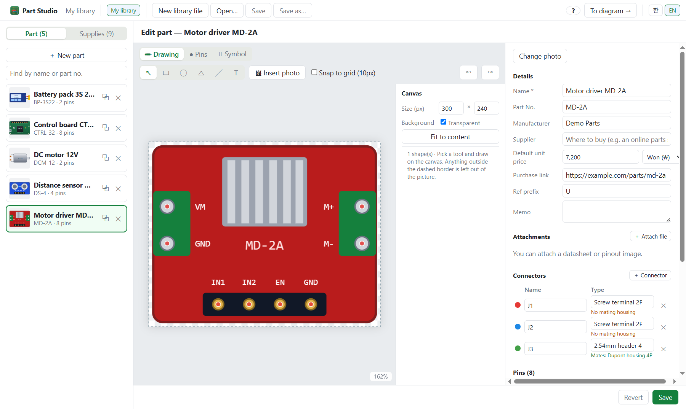 | 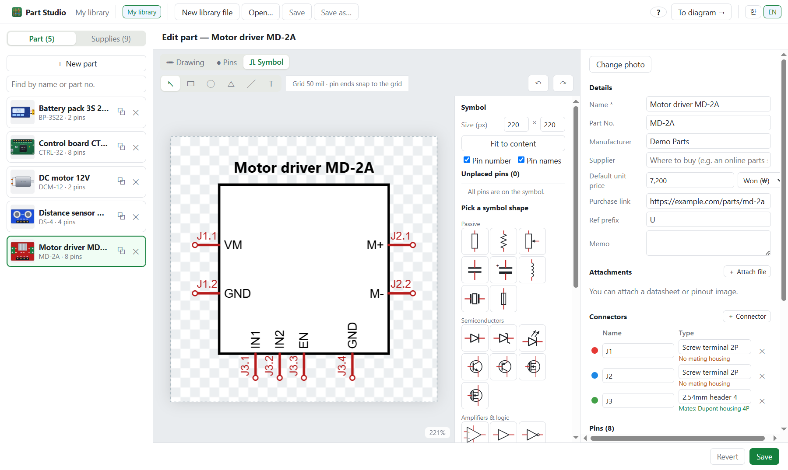 |
| **Part editor** | **Wire specs** |
| 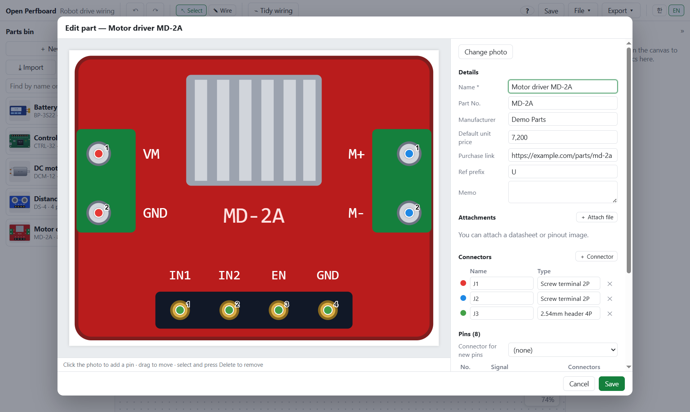 | 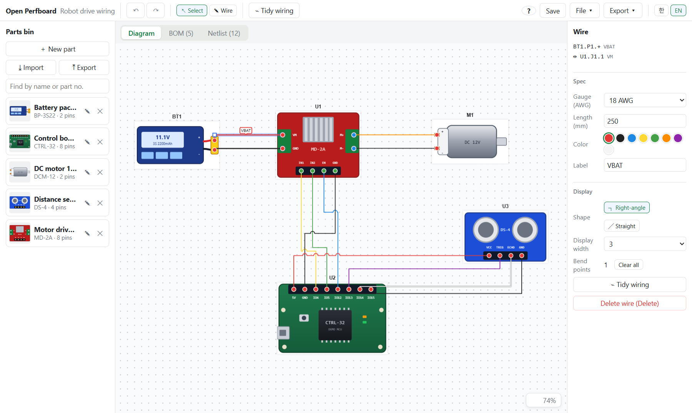 |
| **Bill of materials (BOM)** | **Wire list** |
| 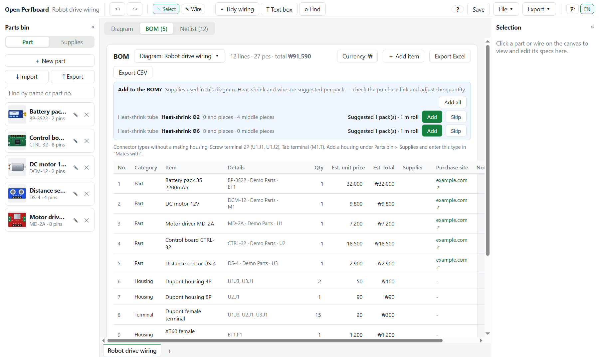 | 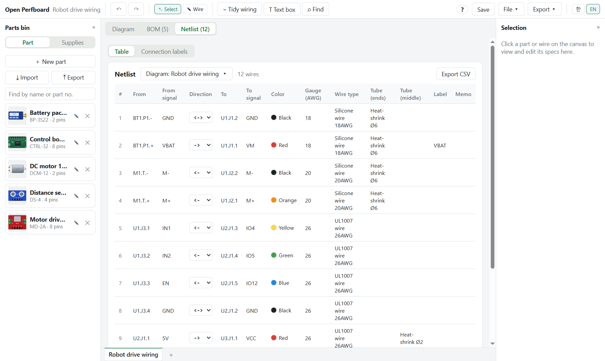 |

**Schematic**: see the same parts and connections as symbols. Long-distance signals such as control lines can be shown as net labels to keep it tidy, and **Export ▾ → KiCad schematic** opens straight in KiCad.

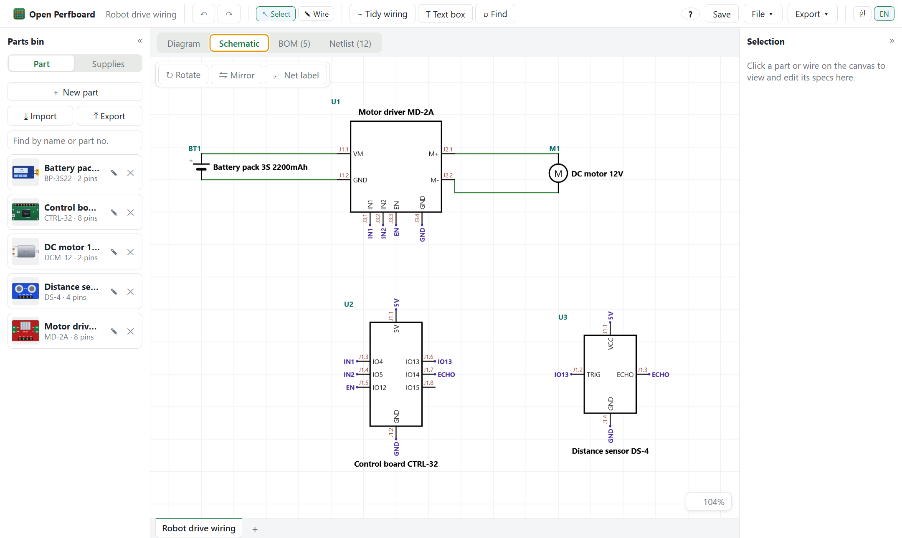

**Netlist connection labels**: a line runs from each pin on the part photo to a name tag. Tags with the same name are connected, and arrows show the signal direction. Click a tag to see its pair and the wire details, and change the signal direction (`->` `<-` `<->`) in the bar above. Click a part photo or **Connections** to open a popup: the part on the left, and its connected parts on the right, one at a time (◀ ▶ or the list).

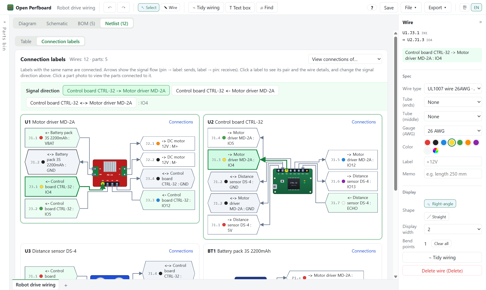

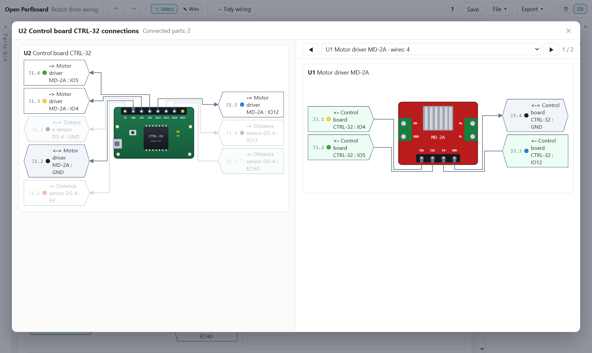

## Install

Download the file for your system from [Releases](../../releases/latest). It works without an account or internet connection.

### Windows 10 / 11 (64-bit)

1. Download `Open.Perfboard.Setup.<version>.exe`
2. Run it (no admin rights needed)

> If Windows shows "Windows protected your PC", click **More info → Run anyway**.

### Linux (64-bit)

| Distribution | File | Install |
| --- | --- | --- |
| Ubuntu / Debian | `open-perfboard-<version>-amd64.deb` | `sudo apt install ./open-perfboard-<version>-amd64.deb` |
| Fedora | `open-perfboard-<version>-x86_64.rpm` | `sudo dnf install ./open-perfboard-<version>-x86_64.rpm` |
| Others | `open-perfboard-<version>-x86_64.AppImage` | `chmod +x`, then run |

After installing, it appears in your app menu and `.opb` files open with a double-click. If Korean text shows as boxes, install a CJK font (Ubuntu `fonts-noto-cjk`, Fedora `google-noto-sans-cjk-fonts`).

> If the AppImage does not start: on Fedora run `sudo dnf install fuse-libs`; on Ubuntu 23.10 or later it may be the sandbox restriction, so the deb package is recommended.

## Usage


1. **Make a part**: **Make a Part** on the home screen → **＋ New part** → draw it or add a photo → click terminals on the **Pins** tab → **Save**
2. **Place**: **Make a Diagram** on the home screen → drag parts onto the canvas
3. **Connect**: `W` → click a pin → click another pin (click empty space to bend)
4. **Check**: the **Schematic / BOM / Netlist** tabs at the top
5. **Export**: **Export ▾** → PDF, Excel, PNG, KiCad schematic

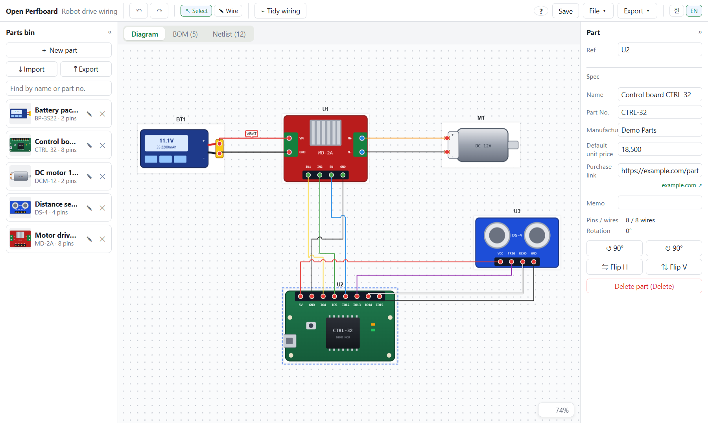


| Key | Action | Key | Action |
| --- | --- | --- | --- |
| `V` / `W` | Select / wire mode | `R` / `F` | Rotate / flip |
| `Esc` | Cancel drawing | `Delete` | Delete |
| `Ctrl+Z` / `Ctrl+Y` | Undo / redo | `Home` | Fit to view |
| Wheel | Zoom in / out | `Space`+drag | Pan |

All shortcuts are listed under the **?** button in the app (`F1`).

## Feedback

- Tell us what got in the way or what could be improved in an [issue](../../issues/new).
- If you like it, a **⭐ star** helps a lot!!!!

## Roadmap

1. Wire cut list
2. Export several diagrams to KiCad at once as hierarchical sheets
3. AI part import
4. I/O ports per diagram and GPIO behavior simulation (Arduino, ESP32, STM32, Raspberry Pi)

The final goal is **firmware compilation and simulation (SILS / HILS)** within this app.

## Development

Requires Node.js 22 or later.

```bash
npm ci              # install dependencies
npm run dev         # run in development
npm run check       # type check + unit tests
npm run test:e2e    # end-to-end tests
npm run dist:win    # Windows installer → dist/
npm run dist:linux  # Linux packages (AppImage, deb, rpm; run on Linux) → dist/
```

The same commands work on Linux (Ubuntu, Fedora). You need a CJK font (Ubuntu `fonts-noto-cjk`, Fedora `google-noto-sans-cjk-fonts`), and to build packages, `rpm` (Ubuntu) or `rpm-build` (Fedora).

> If PowerShell (the default VS Code terminal) says `npm.ps1 cannot be loaded because running scripts is disabled`, run `Set-ExecutionPolicy -Scope CurrentUser RemoteSigned` once and open a new terminal. To leave the setting alone, use `npm.cmd` instead of `npm`.

## License

Copyright (C) 2026 Minsik Oh

[GPL-3.0-or-later](LICENSE). Anyone may use and modify it; if you distribute it or a modified version, you must publish the full source under the same license and keep the copyright notice above.

> This project has been developed by Claude Code.